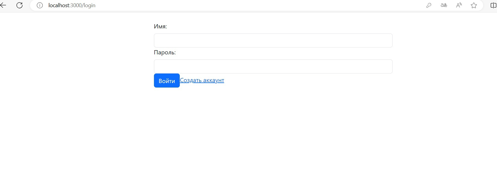
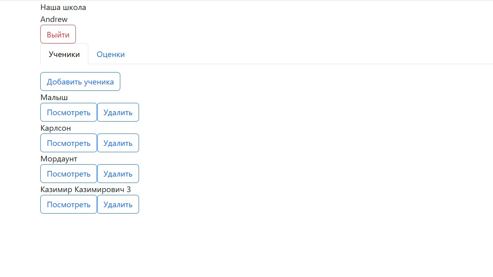
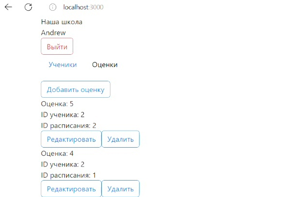
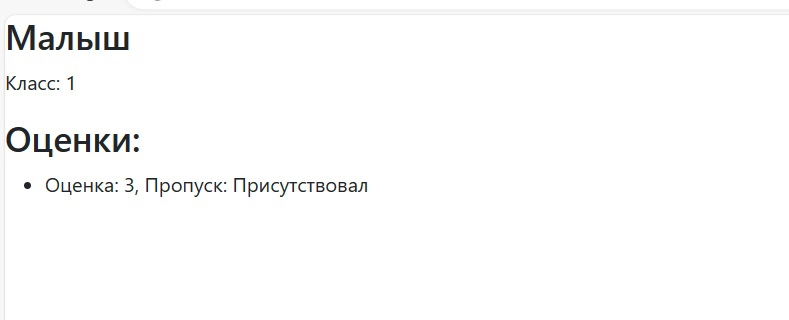
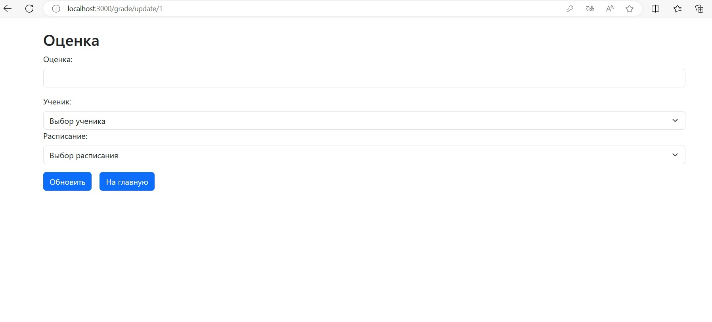

# Отчет по лабораторной работе №4

#### Цель работы:

Ознакомиться с принципами разработки форнтенда для созданного api

## Задание

Создать фронтенд часть для 3 лабораторной работы

## Ход Выполнения:

Приложение написано на фреймворке ReactJS.

Страница регистрации и входа в аккаунт:

Главная страница/Список учеников:

Главная страница/Список оценок

Форма просмотра

Форма редактирования

Форма создания

